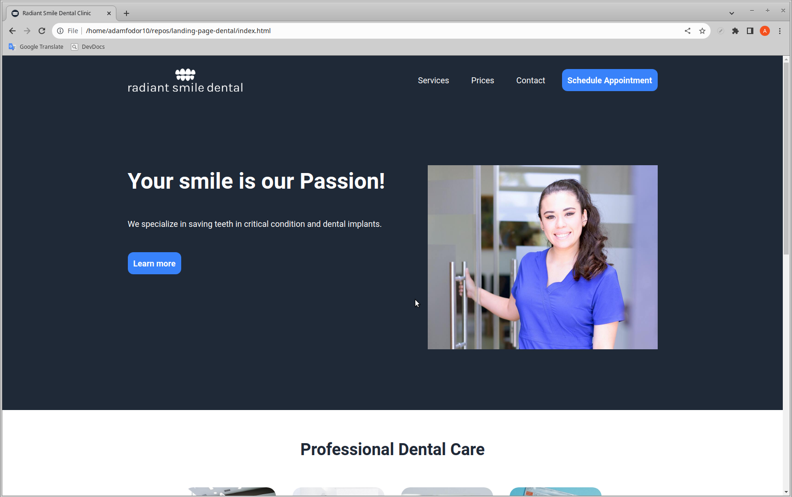
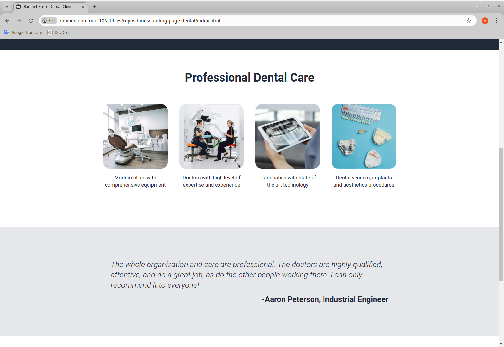

# Landing Page for Dental Business
In this project I created a dummy landing page for Radiant Smile Dental Clinic (dummy Dental Business).
The graphic design was provided by [The Odin Project](https://www.theodinproject.com/lessons/foundations-landing-page) (see images folder of this repository).
I used Flexbox layout extensively to create the CSS design of the web page.

Check out the project at: https://adamfodor10.github.io/landing-page-dental/

## Credits for the photos goes to:
- [Nadezhda Moryak](https://www.pexels.com/photo/teeth-moulds-and-veneers-scattered-on-blue-background-7800553/)
- [Anna Shvets](https://www.pexels.com/photo/female-dentist-and-assistant-examining-patients-teeth-in-clinic-3845981/)
- [Cedric Fauntleroy](https://www.pexels.com/photo/a-tablet-with-a-dental-x-ray-4266945/)
- [annabeauty](https://pixabay.com/illustrations/ai-generated-dental-clinic-clinic-8230961/)
- [Los Muertos Crew](https://www.pexels.com/photo/a-smiling-woman-wearing-scrubs-8460374/)

## Screenshots of the web page:

